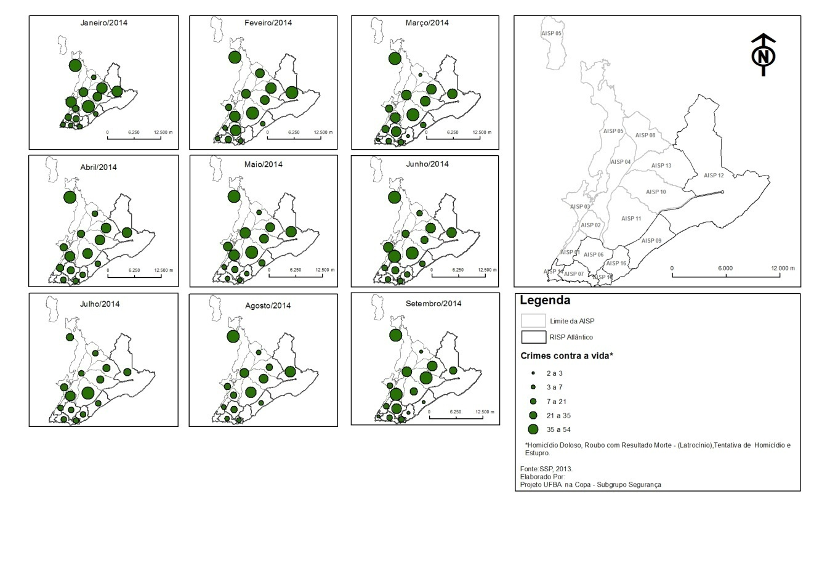

Mini Curso 
========================================================
author: Robson Wilson Silva Pessoa
date: 
autosize: true

Agenda 
========================================================

- Github (+Git)
- R Markdown + Bookdown
- Tidyverse (dplyr, ggplot2, etc)
- Mendley
- Encaminhamentos finais

Github (+Git)
========================================================

- Criar conta no site do Github
- Quais são os significados das palavras?
  - Repositorie
  - Branch
  - Fork

R Markdown + Bookdown
========================================================

Objetivos do projeto: 

- Produção de livros sobre Ciência de Dados para
Estudantes de Escola Pública 
- Produção de livros sobre Inteligência Artificial para
Estudantes de Escola Pública 
- Produzir estrutura do site Reconhecendo Salvador

Figuras Externas
========================================================

  Crimes Violentos Letais Intencionais

[Fonte: Dados do Programa Secretaria de Segurança Pública da Bahia. ](http://www.ssp.ba.gov.br/)

Figuras Externas II
========================================================

